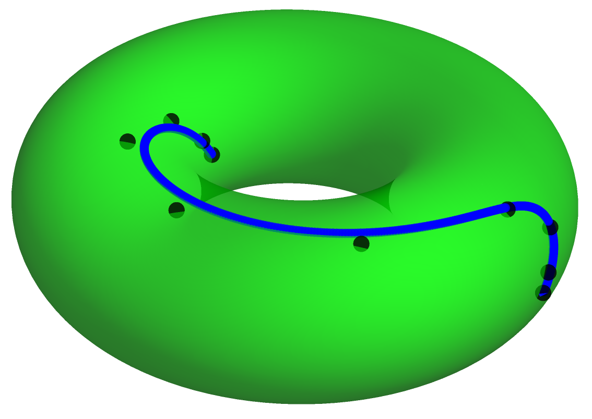

# BSplinesTrajOpt

 ### BSplines-based robot trajectory optimization solver.

<p align="center">
  
</p>

## Description

Direct-collocation techniques with B-Splines and geometric algorithms are used to generate minimum-effort control movements. When humanoid robots are considered, the computation of such movements require to solve the robot inverse dynamics, the center of mass projection and centroidal momentum, for equilibrium purposes, and the partial derivatives of all these features. This is why Lie groups theory plays an important role here to formulate recursive, exact and fast algorithms in order to retrieve first and second order information.

## Getting Started

### Dependencies

Project is created with:
* [CMake](https://cmake.org/) version: 3.10.2
* [gcc](https://gcc.gnu.org/) version: 7.5.0
* [Eigen3](https://eigen.tuxfamily.org/index.php?title=Main_Page) version: 3.3.4
* [CoppeliaSim](https://coppeliarobotics.com/) version: 4.0.0

### Installing

* Install [Ipopt](https://coin-or.github.io/Ipopt/INSTALL.html) at /usr/local/bin and /usr/local/include directories.

* To install this project,
```
$ ./install.sh
```
### Executing program

* Run time tests,
```
$ ./run.sh
```

* Run center of mass example,
```
$ ./run_com_example.sh
```

* Run centroidal momentum example,
```
$ ./run_mu_example.sh
```
## Help

Any advise for common problems or issues please contact the authors.

## Authors

[Alvaro Paz](https://www.linkedin.com/in/alvaro-paz-anaya/)

[Gustavo Arechavaleta](https://sites.google.com/site/gustavoarechavaleta/)

## Version History
* 0.1
    * Initial Release

## License

This project is licensed under the [MIT](https://choosealicense.com/licenses/mit/) License
